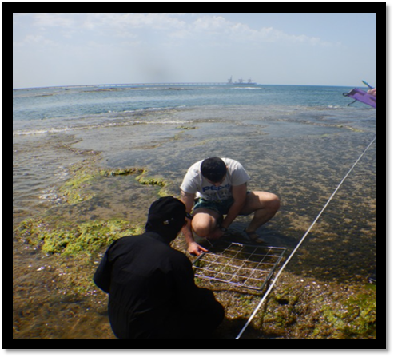
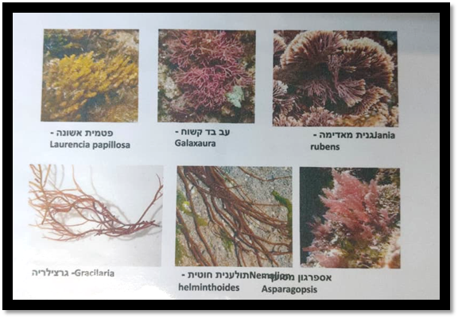
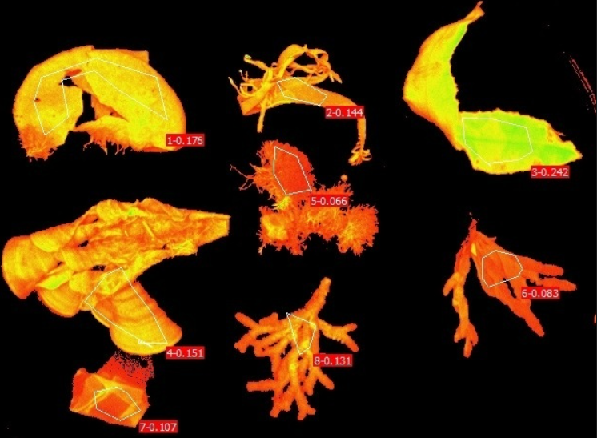
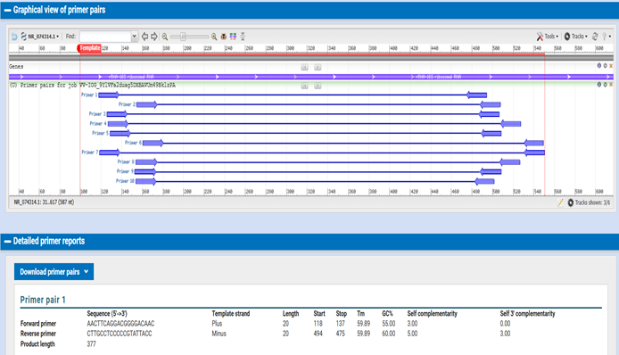

# Primer Design and Phylogenetic Analysis of *Microcystis* sp. Using the 16S rRNA Gene

## 📌 Project Overview
**Project Title:** Primer Design and Phylogenetic Analysis of *Microcystis* sp. Using the 16S rRNA Gene  
**Objective:** The goal of this bioinformatics workflow is to identify a cyanobacterial species belonging to the genus *Microcystis*, construct a phylogenetic tree to analyse evolutionary relationships with related species, and design highly specific PCR primers for its laboratory identification.

### Target Organism and Marker Gene
* **Target Organism:** *Microcystis* sp. (A genus of freshwater cyanobacteria known for forming harmful algal blooms).
* **Barcode Region Used:** 16S ribosomal RNA (16S rRNA) gene.
* **Why this gene is useful:** The 16S rRNA gene is the gold standard for bacterial and cyanobacterial species identification. It contains highly conserved regions (ideal for universal primer binding) interspersed with hypervariable regions (which accumulate mutations and allow for species-level differentiation).

---

## 🧬 1. Sequence Retrieval and BLAST Analysis
A reference sequence of the 16S rRNA gene belonging to *Microcystis* sp. was retrieved from the **NCBI Nucleotide database**.

| Parameter | Information |
| :--- | :--- |
| **Organism** | *Microcystis* sp. |
| **Gene** | 16S rRNA |
| **NCBI Accession Number** | `NR_074314.1` |

<<<<<<< HEAD
> **Screenshot 1: NCBI Sequence Page** > ()

=======
> Screenshot 1: NCBI Sequence Page > 
>>>>>>> 6d9be7cd27553efa2f14185ae872d79606d872b5

To identify closely related species, the reference sequence was analyzed using **NCBI BLASTn** (Nucleotide Collection nr/nt, Highly Similar Sequences). Based on the results, additional sequences were selected for phylogenetic comparison:

| Accession Number | Organism |
| :--- | :--- |
| `NR_074314.1` | *Microcystis* sp. (Reference) |
| `LC557459.1` | Uncultured cyanobacterium clone |
| `OQ874399.1` | Cyanobacterium isolate |
| `MT835121.1` | Cyanobacterium strain |
| `PP272457.1` | Cyanobacterium isolate |

> Screenshot 2: BLAST Results > 

---

## 📊 2. Multiple Sequence Alignment (MSA)
The FASTA sequences of the selected organisms were imported into **MEGA** software and aligned.

* **Software Used:** MEGA (ClustalW)
* **Sequence Type:** DNA

**Identification of Conserved and Variable Regions:**
The multiple sequence alignment output highlighted highly **conserved regions** across all aligned cyanobacterial sequences (indicated by identical nucleotide columns, useful for primer anchoring). It also revealed **variable regions** (including SNPs and indels), which provide the genetic resolution needed to differentiate the species phylogenetically.

> Screenshot 3: Multiple Sequence Alignment Output> 

---

## 🌳 3. Phylogenetic Tree Construction
Using the ClustalW alignment, a phylogenetic tree was constructed to visualize the evolutionary relationships among the sequences.

**Tree-Building Parameters (MEGA):**
* **Software Used:** MEGA
* **Alignment Method:** ClustalW
* **Tree-Building Method:** Neighbor-Joining (NJ)
* **Substitution Model:** Kimura 2-parameter model
* **Bootstrap Replicates:** 1000

> Screenshot 4: Final Phylogenetic Tree > 

**Interpretation of the Phylogenetic Tree:**
* **Clustering:** The reference sequence (`NR_074314.1`) and `LC557459.1` clustered tightly together, indicating a very close evolutionary relationship. `OQ874399.1` and `MT835121.1` formed a second, closely related sister clade.
* **Expected Grouping:** The target organism grouped exactly as expected with related cyanobacterial species, confirming its taxonomic identity within the *Microcystis* genus.
* **Divergence:** `PP272457.1` branched out earlier, showing it is more distantly related to the main *Microcystis* clusters.
* **Bootstrap Values:** The main branches are supported by robust bootstrap values, providing high statistical confidence in the tree topology.

---

## 🎯 4. Primer Design & Verification
PCR primers were designed specifically for the reference sequence (`NR_074314.1`) to enable laboratory amplification of the 16S rRNA region.

* **Software Used:** NCBI Primer-BLAST (incorporating Primer3)

### Primer Specifications

**Forward Primer**
* **Sequence (5'→3'):** `AACTTCAGGACGGGGACAAC`
* **Length:** 20 bp
* **Tm (Melting Temperature):** 59.89°C
* **GC Content:** 55.00%
* **Position:** 118 – 137

**Reverse Primer**
* **Sequence (5'→3'):** `CTTGCCTCCCCCGTATTACC`
* **Length:** 20 bp
* **Tm (Melting Temperature):** 59.89°C
* **GC Content:** 60.00%
* **Position:** 475 – 494

**Expected Amplicon Properties**
* **Amplicon Size:** 377 bp
* **Specificity Verification:** Primer-BLAST specificity checking confirmed that the primer pair specifically targets the intended cyanobacterial sequence without significant off-target matches.

> Screenshot 5: Primer-BLAST Results > 

## 🔬 5. Conclusion
This bioinformatics workflow successfully verified the taxonomic classification of *Microcystis* sp. using 16S rRNA. The sequence alignment and Neighbor-Joining phylogenetic tree confirmed expected evolutionary relationships with robust bootstrap support. Furthermore, highly specific PCR primers were successfully designed (generating a 377 bp amplicon) for future laboratory identification and environmental monitoring.
