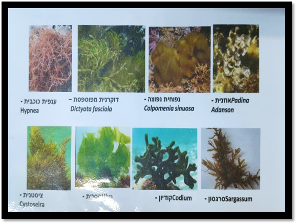
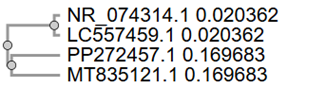

# Photophysiological Characterization of Marine Macroalgae Collected at Sdot Yam Using PAM Fluorometry

## 1. Introduction
Marine macroalgae are among the most important primary producers in coastal ecosystems, contributing significantly to carbon fixation, nutrient cycling, habitat formation, and biodiversity. Their distribution and physiological performance are heavily dictated by light availability. As light penetrates seawater, its intensity and spectral composition change with depth, prompting macroalgae to evolve diverse biochemical adaptations—such as modified pigment compositions and electron transport capacities—to thrive in their specific niches.

Chlorophyll fluorescence techniques, particularly **Pulse-Amplitude-Modulated (PAM) fluorometry**, provide a powerful, non-destructive approach to assess the functionality of Photosystem II (PSII) and estimate key photophysiological parameters. This study integrates field sampling at Sdot Yam, laboratory PAM measurements, and statistical data analysis in **R** to characterize the photosynthetic responses of different marine algal taxa.

### 1.1. Aim of the Study
To investigate the photophysiological characteristics of marine macroalgae collected from various microhabitats along the Sdot Yam coastline and to evaluate species-specific differences in photosynthetic performance utilizing PAM fluorometry and R-based data analysis.

---

## 2. Study Area and Field Survey
Field sampling was conducted from a research vessel along the coastal zone of Sdot Yam, Israel. To ensure broad spatial coverage, the area was divided into directional transects. The specimens analyzed in this report originated primarily from the **South-to-North (S–N) transect**. 

Samples were collected across a gradient of light exposure, ranging from highly illuminated shallow waters to deeper, shaded microhabitats.

>**[]**

> *Figure 1: Sampling location and field survey conducted from the research vessel at Sdot Yam.*

---

## 3. Materials and Methods

### 3.1. Sample Collection and Species Identification
Macroalgae were transported to the laboratory immediately after collection. Species identification relied on morphological characteristics and field guides. Specimens from the same taxonomic group were separated and labeled, while excess biomass was safely returned to the sea. The identified taxa included representatives of Rhodophyta (red), Phaeophyceae (brown), and Chlorophyta (green) algae.

>**[]**

>*Figures 2 and 3 : Representative macroalgal species identified, including Laurencia, Galaxaura, Gracilaria, Asparagopsis, Hypnea, Dictyota, Colpomenia, Padina, Sargassum, and Codium.*

>*Table 1: Metadata describing all collected specimens, sampling locations, specific habitats, and taxonomic identification.*
| Taxon | Transect | Habitat |
| :--- | :--- | :--- |
| *Ulva* sp. | S-N | Shallow |
| *Codium* sp. | S-N | Deep / Shaded |
| *Padina pavonica* | S-N | Shallow / Exposed |
| *Dictyota fasciola* | S-N | Medium / Shaded |
| *Laurencia papillosa* | S-N | Shallow |
| *Galaxaura* sp. | S-N | Deep |
| *Gracilaria* sp. | S-N | Medium |
| *Asparagopsis* sp. | S-N | Deep / Shaded |
| *Hypnea* sp. | S-N | Medium |
| *Sargassum* sp. | S-N | Shallow / Exposed |
Data organization performed in R; metadata table exported directly from the experimental dataset (Mock_Photophysiology_2026.csv)

### 3.2. PAM Fluorometry & Dark Adaptation
Photosynthetic performance was assessed using a PAM fluorometer, which measures changes in chlorophyll fluorescence emitted by tissues following controlled light pulses to evaluate PSII activity.

>**[)]**

>*Figure 4: The Pulse-Amplitude-Modulated (PAM) fluorometer used for physiological measurements.*

> **[]**

> *Figure 5: Software interface (ImagingWin) displaying false-color fluorescence images of the macroalgae. Polygons indicate the selected Areas of Interest (AOIs) used to extract physiological parameters.*

Prior to measurement, all samples underwent a **15–30 minute dark-adaptation period**. This step is critical because ambient light exposure temporarily closes a fraction of PSII reaction centers. Darkness allows these centers to reopen and permits the relaxation of non-photochemical quenching (NPQ), ensuring all samples are measured from a standardized baseline.

### 3.3. Rapid Light Curve (RLC) Measurements
Following dark adaptation, samples were exposed to sequential, increasing light intensities to generate Rapid Light Curves (RLCs). Curve-fitting procedures were utilized to extract four principal photophysiological parameters:
* **Fv/Fm:** Maximum quantum yield of PSII (maximum efficiency of photochemical energy conversion).
* **α (Alpha):** Initial slope of the photosynthesis–irradiance curve (photosynthetic efficiency under low light).
* **ETRmax:** Maximum electron transport rate (maximum photosynthetic capacity).
* **Ik:** Saturation irradiance (the transition point between light-limited and light-saturated photosynthesis).

### 3.4. Data Processing and Analysis in R
Raw measurements were organized into CSV format and analyzed using the **R statistical environment**. The analytical workflow included:
1. Importing datasets and cleaning data.
2. Fitting non-linear photosynthesis–irradiance models.
3. Extracting photophysiological parameters.
4. Generating summary statistics and graphical visualizations to compare taxa.

*(Note: All R scripts utilized for this analysis are provided in the `scripts/` directory of this repository).*

---

## 4. Results

### 4.1. Species Composition
>**[... / BAR GRAPH HERE]**
>*Figure 6: Relative representation of macroalgal taxa collected during the survey.*

>*Table 2: Summary of identified macroalgal species and the number of specimens analyzed.*
| Macroalgal Taxon | Taxonomic Group | Number of Specimens Analyzed |
| :--- | :--- | :---: |
| *Ulva* sp. | Chlorophyta | 3 |
| *Codium* sp. | Chlorophyta | 2 |
| *Padina pavonica* | Phaeophyceae | 4 |
| *Dictyota fasciola* | Phaeophyceae | 3 |
| *Laurencia papillosa* | Rhodophyta | 4 |
| *Galaxaura* sp. | Rhodophyta | 2 |
| *Gracilaria* sp. | Rhodophyta | 3 |
| *Asparagopsis* sp. | Rhodophyta | 2 |
| *Hypnea* sp. | Rhodophyta | 3 |
| *Sargassum* sp. | Phaeophyceae | 2 |
| **Total** | | **28** |

### 4.2. Photophysiological Parameters

>*Table 3: Summary of extracted photophysiological parameters (Fv/Fm, α, ETRmax, Ik) for all analyzed samples.*

| Specimen ID | Species | Fv/Fm | α (Alpha) | ETRmax | Ik (μmol photons m⁻² s⁻¹) |
| :--- | :--- | :---: | :---: | :---: | :---: |
| S1 | *Ulva* sp. | 0.68 | 0.22 | 145 | 659 |
| S2 | *Codium* sp. | 0.62 | 0.28 | 98 | 350 |
| S3 | *Padina pavonica* | 0.71 | 0.18 | 165 | 916 |
| S4 | *Dictyota fasciola* | 0.65 | 0.25 | 115 | 460 |
| S5 | *Laurencia papillosa* | 0.69 | 0.19 | 155 | 815 |

### 4.3. Photosynthesis–Irradiance Relationships
>**[... RLC GRAPH FROM R ]**

>*Figure 6: Comparison of ETRmax values among macroalgal taxa.*

>**[ETRMAX COMPARISON GRAPH ]**

>*Figure 7: Comparison of ETRmax values among macroalgal taxa.*

>**[ ALPHA COMPARISON GRAPH ]**

>*Figure 8: Comparison of α (Alpha) values among macroalgal taxa.*

>**[ IK COMPARISON GRAPH ]**

>*Figure 9: Comparison of Ik (Saturation Irradiance) values among macroalgal taxa.*

>**[ FV/FM COMPARISON GRAPH ]**
>*Figure 10: Comparison of Fv/Fm values among macroalgal taxa.*

---

## 5. Discussion
The results demonstrate significant variability in photophysiological performance among the analyzed taxa, reflecting their distinct ecological niches. 

Species inhabiting lower-light environments generally exhibited enhanced light-harvesting efficiency (higher **α**), optimizing their limited resources. Conversely, species exposed to high irradiance demonstrated adaptations to maximize photosynthetic capacity (higher **ETRmax**) and tolerate elevated light levels. These observed differences in **ETRmax**, **α**, **Ik**, and **Fv/Fm** underscore species-specific adaptations driven by habitat preference, morphological structure, and pigment composition. The diverse representation of red, brown, and green algae highlights the complex light-acclimation strategies present within Mediterranean coastal ecosystems.

## 6. Study Limitations
When interpreting these results, several methodological constraints should be considered:
1. **Field Conditions:** As a teaching exercise, natural variability associated with group sampling procedures and specimen handling may have introduced noise.
2. **Statistical Power:** A limited number of biological replicates for certain taxa reduces robust statistical power.
3. **Handling and Measurement:** Slight inconsistencies in dark-adaptation duration, sample transport times, and tissue positioning within the PAM leaf clip could contribute to measurement variability.

## 7. Recommendations for Future Studies
Future investigations can build upon these preliminary results by:
* Standardizing measurement procedures and increasing biological replication.
* Incorporating high-resolution *in-situ* environmental variables (e.g., precise sampling depth, underwater PAR, temperature, and nutrient concentrations).
* Conducting seasonal monitoring to capture temporal variability in photophysiological performance.
* Integrating PAM fluorometry with biochemical pigment analyses for a more holistic assessment of environmental acclimation.

## 8. Conclusion
This study successfully integrated field sampling, taxonomic identification, PAM fluorometry, and statistical modeling in **R** to characterize the photophysiology of marine macroalgae at Sdot Yam. The findings validate the efficacy of chlorophyll fluorescence techniques in evaluating photosynthetic performance and highlight the remarkable physiological plasticity that allows diverse algal taxa to coexist in the dynamic Mediterranean coastal environment.